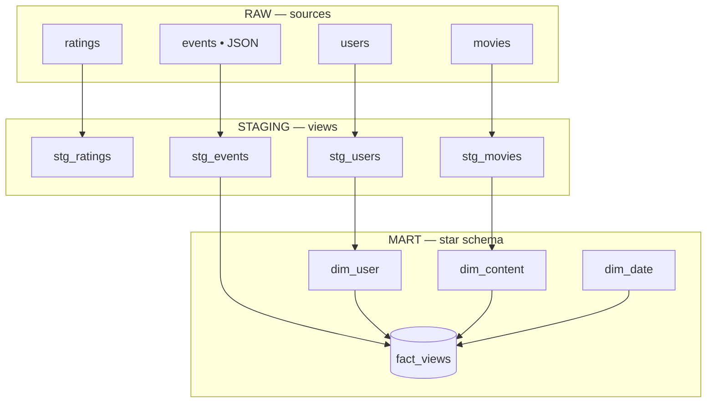

# OTT Viewership Analytics — Snowflake + dbt

An end-to-end analytics engineering project that turns raw movie/OTT data into a
governed **star schema** with tested dbt models and business KPIs — modelled on
real media-analytics work (viewership, content intelligence, audience/TG analysis).

## Architecture
```
Kaggle (MovieLens 1M) + synthetic JSON viewership events
        │  stage + COPY INTO
   RAW        ratings · users · movies · events (VARIANT/JSON)
        │  dbt staging models (SQL: casts, code decoding, JSON parsing via VARIANT)
   STAGING    stg_ratings · stg_users · stg_movies · stg_events   (views)
        │  dbt marts (dimensional modelling)
   MART       dim_user · dim_content · dim_date · fact_views       (tables, star schema)
        │  KPI views
   ANALYTICS  watch-time trend · genre engagement · audience (TG) · device mix
```

## Tech stack
**Snowflake** (cloud data warehouse) · **dbt** (modelling, tests, lineage) ·
**SQL** (window functions, CTEs, `LATERAL`/VARIANT JSON parsing) · **Python**
(synthetic data generation) · **Snowsight** dashboards.

## Data
- **MovieLens 1M** — 1,000,209 ratings, 6,040 users (with demographics), 3,883 titles.
- **Synthetic viewership events** — 300,000 JSON events (watch time, device, country,
  completion) keyed to the real user/movie IDs.

## dbt models
- `models/staging/` — clean & standardise the raw sources (decode age/occupation codes,
  parse the title/year, flatten the JSON `payload`).
- `models/marts/` — the star schema: 3 dimensions + `fact_views`.
- Tests (`models/marts/_schema.yml`): `unique` + `not_null` on dimension keys,
  `relationships` (referential integrity fact → dims), `accepted_values` on `event_type`.

## Lineage

The dbt DAG (also browsable via `dbt docs serve`):



> Tip: you can also drop a screenshot of the `dbt docs` lineage graph into `docs/lineage.png`
> and reference it here for the real rendered view.

## Run it
```bash
# set your Snowflake password for the session
export SNOWFLAKE_PASSWORD=...        # PowerShell: $env:SNOWFLAKE_PASSWORD="..."

dbt debug --profiles-dir .           # verify connection
dbt run   --profiles-dir .           # build staging views + star-schema tables
dbt test  --profiles-dir .           # run data-quality tests
dbt docs generate --profiles-dir . && dbt docs serve --profiles-dir .   # lineage docs
```

> `profiles.yml` (which holds the connection) is git-ignored; the password is read
> from the `SNOWFLAKE_PASSWORD` environment variable, never committed.
